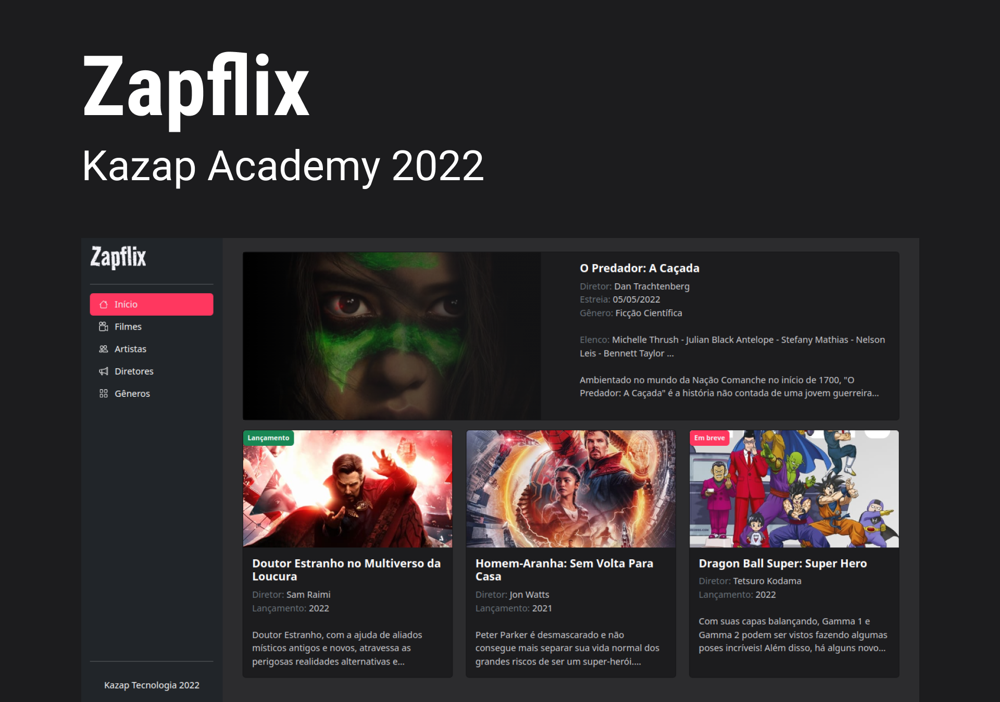

# Zapflix

<p>
  
  
  
  <a href="https://opensource.org/licenses/MIT">
    
  </a>
</p>


## Tópicos

[Sobre](#sobre)

[Tecnologias e Ferramentas](#tecnologias-e-ferramentas)

[Requisitos](#requisitos)

[Instalação e uso](#instalação-e-uso)

[Licença](#licença)

<br>

## Sobre

<p align="center">
  
</p>

ZapFlix é o projeto de finalização do curso Kazap Academy 2022, pensado para aplicar os conceitos vistos em aula. A aplicação funciona como um agregador de conteúdos relacionados ao cinema.

<br>

## Tecnologias e Ferramentas

Algumas das tecnologias utilizadas no desenvolvimento do projeto:

- [Ruby](https://www.ruby-lang.org/en/)
- [Rails](https://rubyonrails.org/)
- [Bootstrap](https://getbootstrap.com/)
- [Sass](https://sass-lang.com/)
- [ViewComponent](https://github.com/github/view_component)
- [VS Code](https://code.visualstudio.com/)

<br>

## Requisitos

Para rodar a aplicação, você precisa ter instalada a versão `16.x` do [Node](https://nodejs.org/en/) e [Ruby](https://www.ruby-lang.org/en/) na versão `3.1.2`.


```bash
node -v
# 16.16.0

ruby -v
# ruby 3.1.2p20 (2022-04-12 revision 4491bb740a) [x86_64-linux]
```

<br>

## Instalação e Uso

```bash
# Abra um terminal e copie este repositório com o comando
git clone https://github.com/martins-rafael/zapflix.git
# ou use a opção de download.

# Entre na pasta web com
cd zapflix

# Instale as dependências com os comandos
yarn
bundle

# Crie o banco de dados de desenvolvimento e rode as migrations
rails db:create
rails db:migrate

# Popule o banco de dados com as seeds
rails db:seed

# Rode o aplicação
bin/dev

# Acesse http://localhost:3000 no seu navegador.
```

<br>

## Licença

<a href="https://opensource.org/licenses/MIT">
  
</a>

<br>

Esse projeto está sob a licença MIT. Veja o arquivo [License](/License) para mais detalhes.

---

Made with :purple_heart: by [Rafael Martins](https://github.com/martins-rafael)

[](https://www.linkedin.com/in/rafaeldcmartins/)
[](mailto:rafaeldcmartins@gmail.com)
